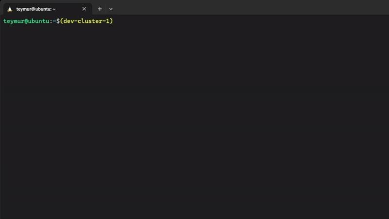

# kc - Kubernetes Context Manager

kc is a Bash script that simplifies the management of Kubernetes configuration contexts making it more convenient to work with many different clusters. It provides an easy way to generate and switch between contexts, list available contexts, and enhance your command prompt with context information.


## Features:
- Merge multiple Kubernetes configuration context files with a single command.
- Switch between contexts using just numbers.
- Always know the current context and differentiate "production" ones by color.

## Install
```
curl -o ~/kc.sh -L https://raw.githubusercontent.com/teymurgahramanov/kc/main/kc.sh && \
  echo "source ~/kc.sh" >> ~/.bashrc && \
  source ~/.bashrc
```

## Usage
Look at "help"
```
kc -h
```